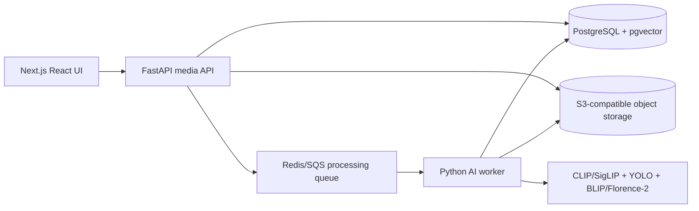

# Photostream AI gallery architecture

## 1. System architecture



- **Frontend:** Next.js, React, TypeScript, Tailwind CSS, lazy thumbnails, lightbox originals, responsive masonry columns, date grouping, multi-select, and hover previews.
- **API:** FastAPI receives upload sessions, stores originals in S3-compatible storage, persists metadata in PostgreSQL, and enqueues AI processing jobs.
- **Database:** PostgreSQL stores media metadata, AI captions, object labels, keyword search vectors, and semantic embeddings through `pgvector`.
- **Storage:** S3-compatible buckets separate originals, thumbnails, and previews. Originals are immutable; thumbnails/previews can be regenerated.
- **AI worker:** Python worker extracts EXIF/video metadata, creates thumbnails and preview clips/frames, generates embeddings, detects objects, captions media, and updates processing status.

## 2. Database schema

The canonical schema lives in [`db/schema.sql`](../db/schema.sql). It includes:

- `media_items` for original URL, thumbnail URL, preview URL, media type, size, dimensions, duration, timestamps, caption, labels, embedding, and status.
- `search_document` generated from captions and labels for full-text keyword search.
- `hnsw` vector index for fast cosine-similarity search.

## 3. API endpoints

| Method | Path | Purpose |
| --- | --- | --- |
| `POST` | `/api/media/uploads` | Create presigned upload targets and queued `media_items` rows. |
| `POST` | `/api/media/{id}/complete` | Mark an object upload complete and enqueue AI processing. |
| `GET` | `/api/media` | Paginated gallery feed, sorted by creation date, with cursor pagination. |
| `GET` | `/api/media/search?q=&cursor=` | Hybrid keyword + vector search. |
| `GET` | `/api/media/{id}` | Fetch full metadata and AI annotations for lightbox. |
| `DELETE` | `/api/media/{id}` | Delete DB row and S3 objects. |
| `GET` | `/api/media/{id}/download` | Return a short-lived signed original download URL. |
| `POST` | `/api/media/bulk-delete` | Delete selected items. |

## 4. AI processing pipeline

1. API validates MIME type and file size, stores original in S3, and writes `processing_status = queued`.
2. Worker downloads the original and sets `processing_status = processing`.
3. Metadata extraction:
   - Images: EXIF creation date, width, height, orientation, file size, color profile.
   - Videos: duration, width, height, frame rate, codec, creation timestamp.
4. Renditions:
   - Generate WebP/AVIF thumbnail around 512-960 px wide.
   - For images, optionally generate 8-12 low-resolution preview frames for fast hover animation.
   - For videos, generate a short muted MP4/WebM preview clip and poster thumbnail.
5. AI inference:
   - Generate image embedding with SigLIP or CLIP from the thumbnail/key frame.
   - Detect objects with YOLOv8/YOLOv11 and normalize labels.
   - Caption with BLIP or Florence-2.
6. Persist labels, caption, embedding, dimensions, duration, URLs, and `processing_status = ready`.
7. If inference fails, persist `processing_status = failed` with `error_message`; thumbnails can still be shown if available.

## 5. Search ranking logic

Hybrid search should combine lexical evidence and semantic similarity:

```sql
WITH query_embedding AS (
  SELECT $1::vector AS embedding
), candidates AS (
  SELECT
    media_items.*,
    ts_rank_cd(search_document, websearch_to_tsquery('english', $2)) AS keyword_score,
    1 - (embedding <=> (SELECT embedding FROM query_embedding)) AS vector_score,
    CASE WHEN labels::text ILIKE '%' || $2 || '%' THEN 0.15 ELSE 0 END AS label_boost
  FROM media_items
  WHERE processing_status = 'ready'
    AND (
      search_document @@ websearch_to_tsquery('english', $2)
      OR embedding IS NOT NULL
    )
)
SELECT *,
  (0.45 * keyword_score) + (0.45 * vector_score) + label_boost AS final_score
FROM candidates
ORDER BY final_score DESC, created_at DESC
LIMIT $3 OFFSET $4;
```

Recommended production behavior:

- Embed the query with the same CLIP/SigLIP text tower used for image embeddings.
- Retrieve top 200 vector candidates and top 200 keyword candidates, merge by ID, then rerank.
- Normalize scores per result set before weighted fusion.
- Boost exact label matches for searches like `dog`, `baby`, or `car`.
- Keep latency low by caching frequent query embeddings and using cursor pagination.

## 6. UI components

This repo includes a runnable Next.js UI prototype:

- `MediaGallery`: orchestration, query state, selection state, and lightbox state.
- `SearchBar`: natural-language search input.
- `UploadButton`: multi-file image/video picker.
- `MediaGrid`: responsive masonry-style columns and empty state.
- `MediaCard`: rounded media tile with image zoom, quick actions, selection, and video hover playback.
- `DateGroupHeader`: sticky grouping labels such as Today, Yesterday, and April 2026.
- `SelectionToolbar`: floating multi-select actions.
- `MediaLightbox`: original preview, labels, caption, metadata, download, and delete actions.

For thousands of assets, replace the CSS columns prototype with a virtualized masonry implementation such as `@tanstack/react-virtual` lanes or a server-paginated `react-photo-album` feed. Keep thumbnails in the grid and load originals only inside the lightbox.

## 7. Hover preview behavior

- Image cards use `thumbnail_url` by default and swap to `preview_url` at larger breakpoints, with a smooth `scale(1.05)` hover effect.
- Video cards use `poster=thumbnail_url`, `muted`, `loop`, `playsInline`, `preload=metadata`, and play only while hovered. Mouse leave pauses and resets to the first frame.
- Quick action buttons fade in over a gradient overlay to avoid heavy borders.

## 8. Deployment suggestion

- **Frontend:** Vercel or containerized Next.js on Kubernetes/Fly.io/Render.
- **API:** FastAPI on ECS/Fargate, Kubernetes, or Render with autoscaling.
- **Database:** Managed PostgreSQL with pgvector, such as Supabase, Neon, RDS PostgreSQL, or Crunchy Bridge.
- **Queue:** Redis Queue, Celery + Redis, SQS, or Cloud Tasks.
- **Storage:** S3, Cloudflare R2, MinIO, or Backblaze B2.
- **AI workers:** GPU-enabled instances for batch backfills; CPU workers can handle thumbnail extraction. Keep models warm and expose metrics for queue lag and inference latency.
- **CDN:** Put thumbnails/previews behind CloudFront/Cloudflare CDN with long cache TTLs and content-hashed keys.
